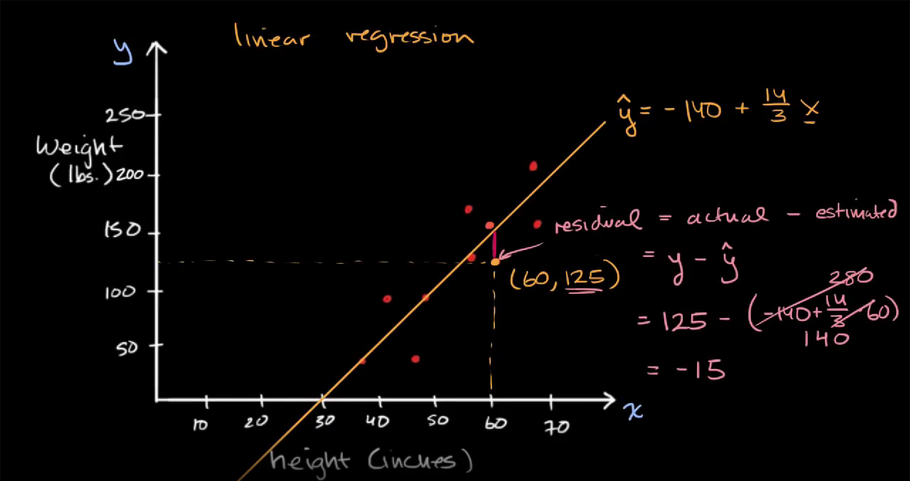

# **Workflow for AI-Projects** 

*Report by Andreas Svensson*

This report explores a theoretical approach to AI-projects using the machine learning algorithm linear regression. To narrow the scope and reach a more easily understood explanation, a specific example of predicting house prices with the algorithm is used.

<br/><br/>

## **Algorithm Explanation** 
Linear Regression uses the following formula:  

**Y = a + bX\***

where:  
**Y = Dependent variable**  
The variable being predicted by the algorithm, house price in this example.  

**X\* = Explanatory variables**  
Variable(s) x1, x2 ... attempting to "explain" the target variable (Y)  
In this example it could be parameters such as living area, number of floors, etc.  

**a = Baseline value**  
Value of the target variable (Y) when explanatory variables (X*) are 0  
In this example, the house price when selected variables living area, number of floors, etc. are 0. In other words, the price of a house without any features, the cheapest a house can be.  

**b = Coefficient**  
The amount explanatory variables (X*) adds to the target variable (Y)  
In this example, how much the price is affected based on living area, number of floors, etc.

<br/><br/>

## **Algorithm Usage** 

Below follows an example of linear regression use, where the dependent variable (Y) is house price, and explanatory variables (X*) are; living area (ft), floors, and year built 

---
<details>
  <summary> Example Calculation </summary>
  
```py
**IN**:
model3 = lm(price ~ sqft_living + floors + yr_built, data = data)
summary(model3)

**OUT**:
Call:
lm(formula = price ~ sqft_living + floors + yr_built, data = data)

Residuals:
     Min       1Q   Median       3Q      Max 
-1669759  -134816   -16331   102089  4092350

Coefficients:
              Estimate Std. Error t value Pr(>|t|)    
(Intercept)  5.595e+06  1.304e+05   42.92   <2e-16 ***
sqft_living  2.948e+02  2.018e+00  146.10   <2e-16 ***
floors       7.517e+04  3.731e+03   20.15   <2e-16 ***
yr_built    -2.933e+03  6.767e+01  -43.35   <2e-16 ***
---
Signif. codes:  0 ‘***’ 0.001 ‘**’ 0.01 ‘*’ 0.05 ‘.’ 0.1 ‘ ’ 1

Residual standard error: 250800 on 21609 degrees of freedom
Multiple R-squared:  0.5335, Adjusted R-squared:  0.5334 
F-statistic:  8237 on 3 and 21609 DF,  p-value: < 2.2e-16
```
*Source [towardsdatascience](https://towardsdatascience.com/linear-regression-the-basics-4daad1aeb845)*  
</details>

---  

Using the above example, we can read the following values: 
<br/><br/>


**r2 (R-squared)** - 0.5335  
Describes how much of the target variable is explained by the model (from 0 to 1). 

**Adjusted R-squared** - 0.5334  
Should be used instead when multiple explanatory variables are used in the model.   
In this case, our 3 explanatory variables explain 53% of the house price.  

**Residuals**  
Describes how large the difference between actual y-levels of data points is, compared to the calculated regression line. Residual values should be as close to 0 as possible - low difference between the actual points and the points estimated by the algorithm. In the image below you can see the calculation from *[khanacademy](https://www.khanacademy.org/math/ap-statistics/bivariate-data-ap/xfb5d8e68:residuals/v/regression-residual-intro)*  for a residual in one specific point.



**Coefficients**  
The field "Estimate" gives us the a and b values, where "Intercept" is the a, and the value of explanatory variables is b(x*) 

**p-value** - 2.2e-16  
Indicates confidence level of estimation  
The indicated confidence level can be calculated as 1 - p-value. In other words, you want the p-value to be as low as possible, below 0.05 is considered statistically significant.

<br/><br/>

## **Data Gathering** 

If you are employed by a company to solve an internal task, they often have the data for you to use.  
Otherwise, some commonly used places for finding datasets to use in machine learning are:   
- Google dataset search  
- Kaggle  
- GitHub  
- Government sources  
- FiveThirtyEight  
- data.world  

If none of the above examples are sufficient, and you can generate data yourself, it is also possible to make your own datasets based on generated data. This requires a case where data can be readily created and fed back into the algorithm by the application you are using or by generating data from polls.

<br/><br/>

## **Formatting Data**

Raw data usually has various inconsistencies that need to be resolved before moving on to the next step.  
Important things to look for are:

- Missing values 
- Different file formats 
- Outlying data points 
- Inconsistencies in variable values 
- Irrelevant feature variables 

Anything that is immediately out of place should be handled before moving into more thorough data preparation. Remove any unnecessary values and merge remaining data into files of a format that can be used later (such as .csv).

<br/><br/>

### **Data Preparation** 

Once the data has been looked over, it is time to explore it more thoroughly and prepare it for use in our algorithm. This step includes:

- Data transformation 
- Exploratory data analysis  
- Data cleaning  
- Feature selection  
- Feature engineering  

### **Scaling** 

A part of feature engineering. To get the most accurate results from any given model, it is best to scale all data used to equal levels to not skew output results in favor of larger input values. There are several equations to rescale data, below follows one specific example in code.

---

<details>
  <summary> Example Calculation </summary>
  
```py
def scaling_function(raw_data): # scale values of a list to between 0 and 1

    # store xmax and xmin values for below equation
    x_max = max(raw_data)
    x_min = min(raw_data)

    # scale data to between 0-1 using z = (x - xmin) / (xmax - xmin)
    scaled_data = [(x - x_min) / (x_max - x_min) for x in raw_data]

    # return scaled data
    return scaled_data

# raw data containing unscaled values
meters_from_communal_transport = [15000, 18000, 12000, 10000]
kilometers_from_communal_transport = [15, 18, 12, 10]
amount_floors = [1, 2, 3, 5]

# calling scaling function to get scaled values between 0 and 1 returned and printing the results
print(scaling_function(meters_from_communal_transport))
print(scaling_function(kilometers_from_communal_transport))
print(scaling_function(amount_floors))
```
Above code snippet returns the following values:

[0.625, 1.0, 0.25, 0.0]  
[0.625, 1.0, 0.25, 0.0]  
[0.0, 0.25, 0.5, 1.0]  

</details>  

---

In this example, values are scaled to between 0 and 1 regardless of their initial values, such that smaller values (number of floors) affect the algorithm equally to larger values (distance to communal transport in meters).

We also see that whether the distance from communal transport was measured in meters or kilometers in our dataset, we still get the same result after scaling.

### **Tools** 

Python is a useful tool to utilize for analysis and preparation of data going into a machine learning algorithm since it has libraries to both process and present data (for analysis). It can also be used to implement machine learning models and work with those, and the output from them.  

Some other useful tools for data preparation are:  
Tableau  
Power BI  
Alteryx  
SAP Data Intelligence Cloud 

<br/><br/>

## **Finalizing**

At this stage, if there are results to be presented, they can be graphed out in a relevant manner to further empathize the points made. In our case, if we have done a sufficiently thorough job in handing our data, we now have a model ready to predict house prices based on new input variables!

<br/><br/>

## **Sources**

[yale - linear regression](http://www.stat.yale.edu/Courses/1997-98/101/linreg.htm#:~:text=A%20linear%20regression%20line%20has,y%20when%20x%20%3D%200)  
[towardsdatascience - linear regression basics](https://towardsdatascience.com/linear-regression-the-basics-4daad1aeb845)  
[towardsdatascience - feature scaling](https://towardsdatascience.com/all-about-feature-scaling-bcc0ad75cb35)  
[projectpro - data preparation for machine learning](https://www.projectpro.io/article/data-preparation-for-machine-learning/595)  
[chartio - where to find free datasets and how to know if they are good quality](https://chartio.com/learn/data-analytics/where-to-find-free-datasets/)  
[khanacademy - regression residuals](https://www.khanacademy.org/math/ap-statistics/bivariate-data-ap/xfb5d8e68:residuals/v/regression-residual-intro)  
[baeldung - batch normalization](https://www.baeldung.com/cs/batch-normalization-cnn#normalization)  
[baeldung - normalization vs standardization](https://www.baeldung.com/cs/normalization-vs-standardization)  
